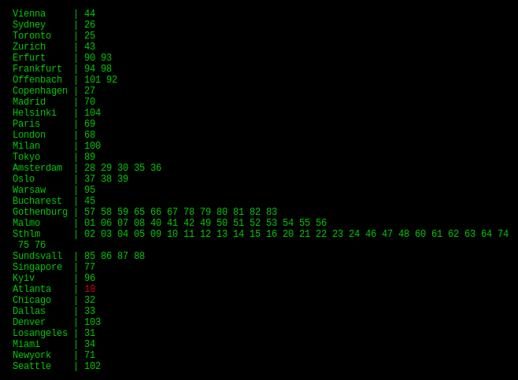

> [!IMPORTANT]
> Since I'm no longer a customer of OVPN, I decided to archive this project. While the current code still works as of 30.04.2026, please consider using a different solution in the future, as this project will no longer be maintained.

## OVPN Status

Shows [OVPN](https://www.ovpn.com/en/network) [server status](https://status.ovpn.com/) in the terminal.

<!--  -->

